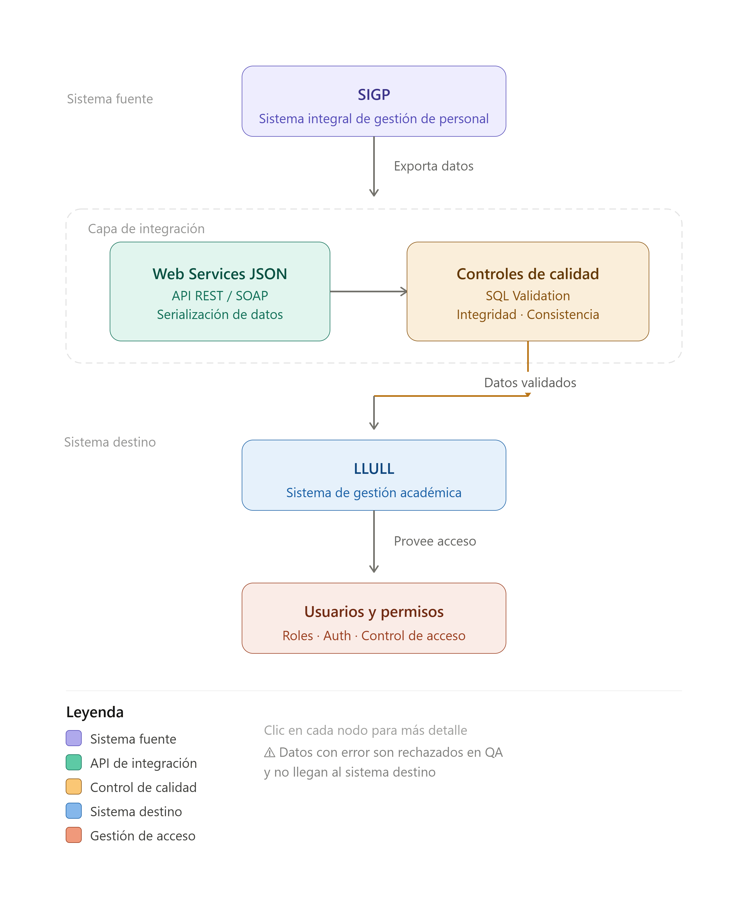
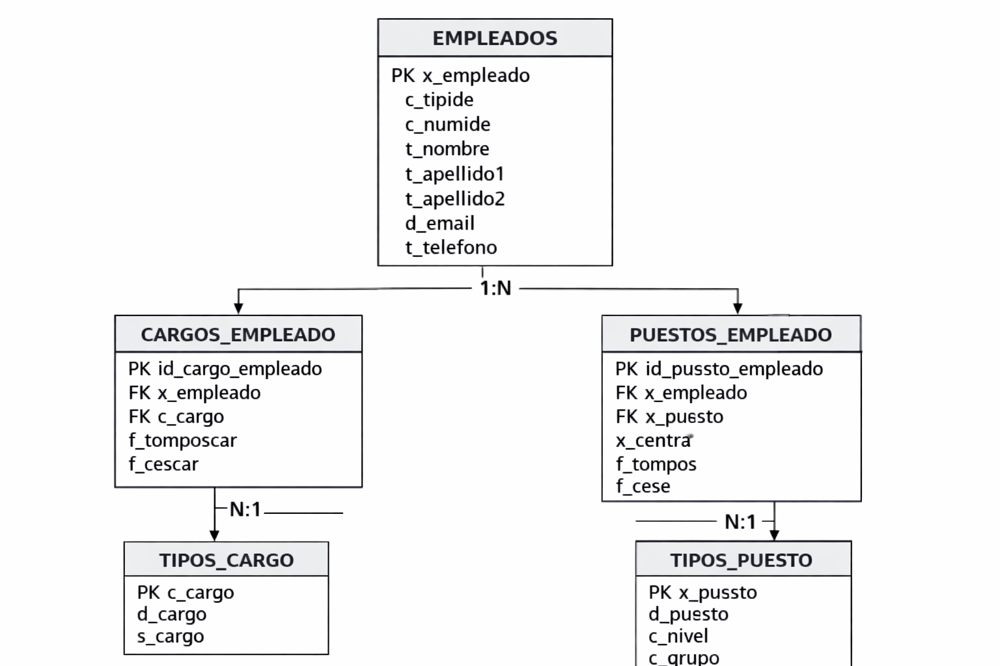

# Análisis y Diseño de Controles de Calidad para una Integración Real entre Sistemas de RRHH

**Portfolio Project**

SQL · Data Quality · Data Governance · Data Modeling · Business Analysis

---

## Descripción

Este proyecto presenta un caso de estudio basado en una integración real entre sistemas de gestión de personal utilizados dentro del ámbito educativo.

La iniciativa surge a partir del análisis de procesos de sincronización entre **SIGP (Sistema Integrado de Gestión de Personal)**, fuente oficial de información de empleados, y **LLULL**, plataforma encargada de gestionar usuarios, perfiles y permisos dentro del entorno educativo.

El objetivo consiste en diseñar controles de calidad de datos que permitan validar la información proveniente de sistemas externos antes de ser consumida por sistemas dependientes.

Por motivos de confidencialidad, los datos originales no son publicados. Se utilizan estructuras anonimizadas y ejemplos representativos que permiten reproducir la lógica del proyecto sin exponer información sensible.

---

## Problema de Negocio

Las integraciones entre sistemas dependen de que la información intercambiada sea consistente y confiable.

Errores en empleados, puestos, cargos o fechas pueden provocar:

* Usuarios sin acceso a aplicaciones corporativas.
* Asignaciones incorrectas de perfiles.
* Incidencias operativas.
* Incremento de tareas manuales.
* Pérdida de trazabilidad.
* Problemas de sincronización entre sistemas.

### Pregunta de Negocio

**¿Cómo garantizar que los datos recibidos desde sistemas externos sean consistentes antes de ser utilizados por otros sistemas?**

---

## Arquitectura de Integración



La integración analizada sigue un esquema de consumo de servicios web donde SIGP actúa como sistema fuente y LLULL como sistema consumidor.

Entre ambos sistemas se incorporan controles de calidad orientados a validar la información antes de su sincronización.

---

## Modelo de Datos



El modelo se encuentra normalizado hasta Tercera Forma Normal (3NF) para minimizar redundancias y garantizar la integridad referencial.

---

## Reglas de Calidad Implementadas

### Unicidad

Un empleado debe poseer un identificador único.

### Integridad Referencial

Todo cargo debe existir en su catálogo oficial.

Todo puesto debe existir en su catálogo oficial.

### Consistencia Temporal

La fecha de cese debe ser posterior a la fecha de toma de posesión.

### Completitud

Todo empleado activo debe poseer un puesto vigente.

### Validez

Los códigos utilizados deben existir en los catálogos maestros.

---

## Validaciones SQL

El proyecto incluye consultas SQL para detectar:

* Identificadores duplicados.
* Puestos inexistentes.
* Cargos inexistentes.
* Fechas inconsistentes.
* Empleados sin puesto vigente.

### Archivos SQL incluidos

```text
sql/
├── 01_nif_duplicados.sql
├── 02_puestos_invalidos.sql
├── 03_cargos_invalidos.sql
├── 04_fechas_inconsistentes.sql
└── 05_empleados_sin_puesto.sql
```

Ejemplo:

```sql
SELECT
    c_numide,
    COUNT(*) AS cantidad
FROM empleados
GROUP BY c_numide
HAVING COUNT(*) > 1;
```

---

## Evidencias

### Exploración de estructuras JSON


### Validaciones SQL


---

## KPIs Propuestos

| KPI                          | Objetivo                            |
| ---------------------------- | ----------------------------------- |
| % Empleados sincronizados    | Medir efectividad de la integración |
| Empleados sin puesto vigente | Detectar incidencias                |
| Integridad referencial       | Validar consistencia de catálogos   |
| Incidencias por carga        | Medir calidad global                |
| Tiempo de resolución         | Seguimiento operativo               |

---

## Tecnologías Utilizadas

* SQL
* Git
* GitHub
* Modelado de Datos
* Documentación Técnica

---

## Competencias Aplicadas

* Data Quality
* Data Governance
* Data Modeling
* Business Analysis
* Integración de Sistemas
* Análisis Funcional

---

## Estructura del Repositorio

```text
├── README.md
├── pdf/
│   └── Proyecto_SIGP_LLULL_Data_Quality.pdf
├── sql/
├── sample_data/
├── diagrams/
└── images/
```

---

## Documentación Completa

La documentación detallada del proyecto se encuentra disponible en:

```text
pdf/Proyecto_SIGP_LLULL_Data_Quality.pdf
```

---

## Consideraciones de Confidencialidad

Los conjuntos de datos originales utilizados durante el análisis contienen información sensible y no son publicados.

Para preservar la privacidad y cumplir los principios de gobierno del dato, se utilizan ejemplos anonimizados que permiten reproducir la lógica del proyecto sin exponer información personal ni institucional.

---

## Principales Aprendizajes

* La calidad de los datos debe incorporarse desde el diseño de la integración.
* Las integraciones requieren mecanismos de validación independientes.
* SQL puede utilizarse como herramienta de auditoría y control.
* La documentación funcional es tan importante como la implementación técnica.
* Los procesos de gobierno del dato reducen riesgos operativos y mejoran la trazabilidad.

---

## Autor

**Gerónimo Daguerre**

Analista de Datos | SQL | Data Quality | Data Governance | Business Analysis

---

## Licencia

Proyecto desarrollado con fines educativos y de portfolio profesional.

Los ejemplos incluidos son ilustrativos y no contienen información real ni datos personales identificables.
